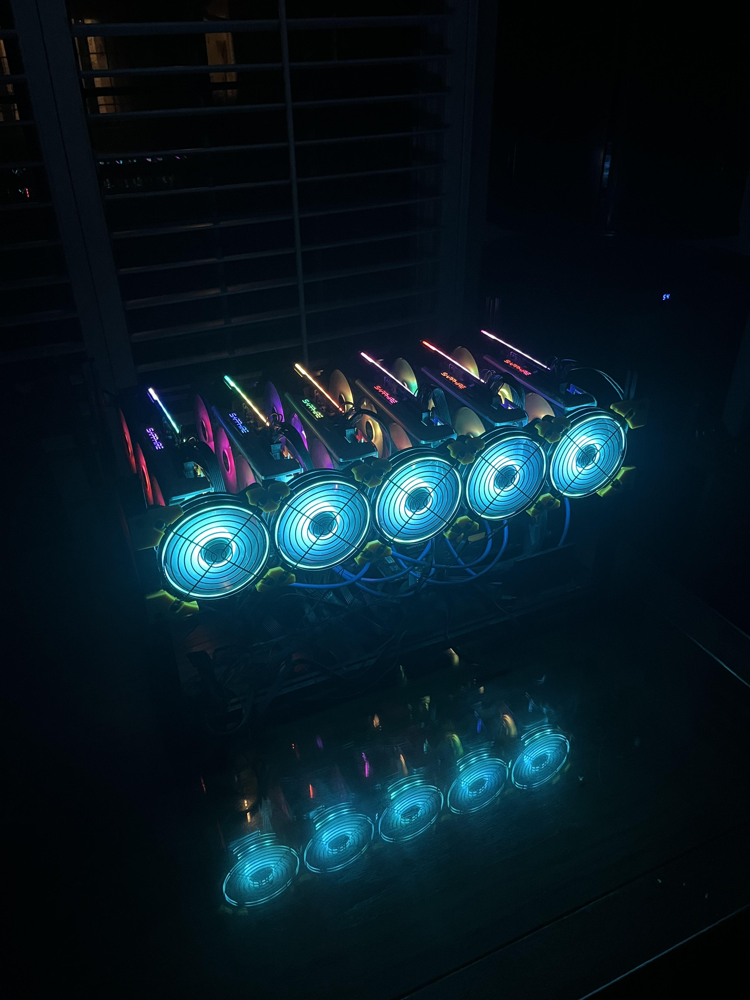

As the crypto wave of 2021 was taking off, I decided to build a crypto mining rig in my dorm room to mine Ethereum. I used 6 AMD 5700 XT GPUs, an Intel Celeron CPU, and a Biostar 250motherboard. This resulted in a machine with about 312MHs. I ran a version of Linux called HiveOS on the machine. I undervolted the GPUs to save power and was able to draw about 600W in total from all 6 GPUs while maintaining my hashrate. It did still make for a rather colorful space heater in my dorm room with the RGB fans and lights from the GPUs. 

Since Ethereum moved to Proof of Stake, I no longer had a need for the mining rig and donated it to the Quantum Computing Association at Georgia Tech.