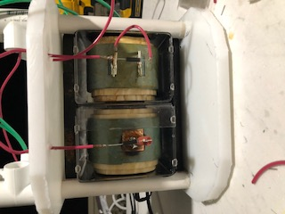
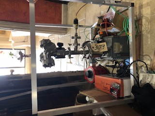
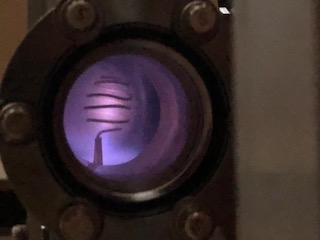
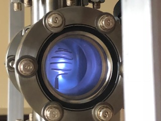

During the Spring of 2017 I embarked on a quest try and build a small inertial electrostatic confinement fusion reactor device with a close friend from Florida. 
This was a multi year and multi dimensional project that required learning lots of new skills such as high vaccuum engineering, high voltage electronics design, neutron detector design. Given that we were on a budget, many of the requisite parts were sourced from eBay or other second hand sources. Here are some of the photos of the set up and air plasma photos we got: 

<pr>
The working principal of an IEC fusion reactor is that an electrically isolated metal grid inside a metal vacuum chamber is charged with a very large (typically 10s of kilovolts)negative voltage while keeping the metal vacuum chamber grounded. This voltage difference produces a large electric field which ionizes gas molecules in the chamber. These positively charged ions then accelerate towards the grid and collide, creating a plasma. If deuterium gas is admitted into the chamber with the right voltages and vacuums maintained, some of the ionized deuterium will fuse, producing neutrons. These neutrons escape the vacuum chamber and can be measured with a neutron detector, confirming that fusion is taking place.  
</pr>

<figure>
    
    <figcaption>Xray transformer and HDPE frame used for generating a high voltage for the grid of the reactor. This whole frame was kept in mineral oil to prevent coils arcing over. <figcaption>
</figure>

<figure>
    
    <figcaption>Full experimental set up used for vacuum testing and generating an air plasma in the chamber.<figcaption>
</figure>

<figure>
    
    
    <figcaption>Resultant air plasma photos generated after pulling a vacuum (100mTorr) and applying -10kV on the grid<figcaption>
</figure>