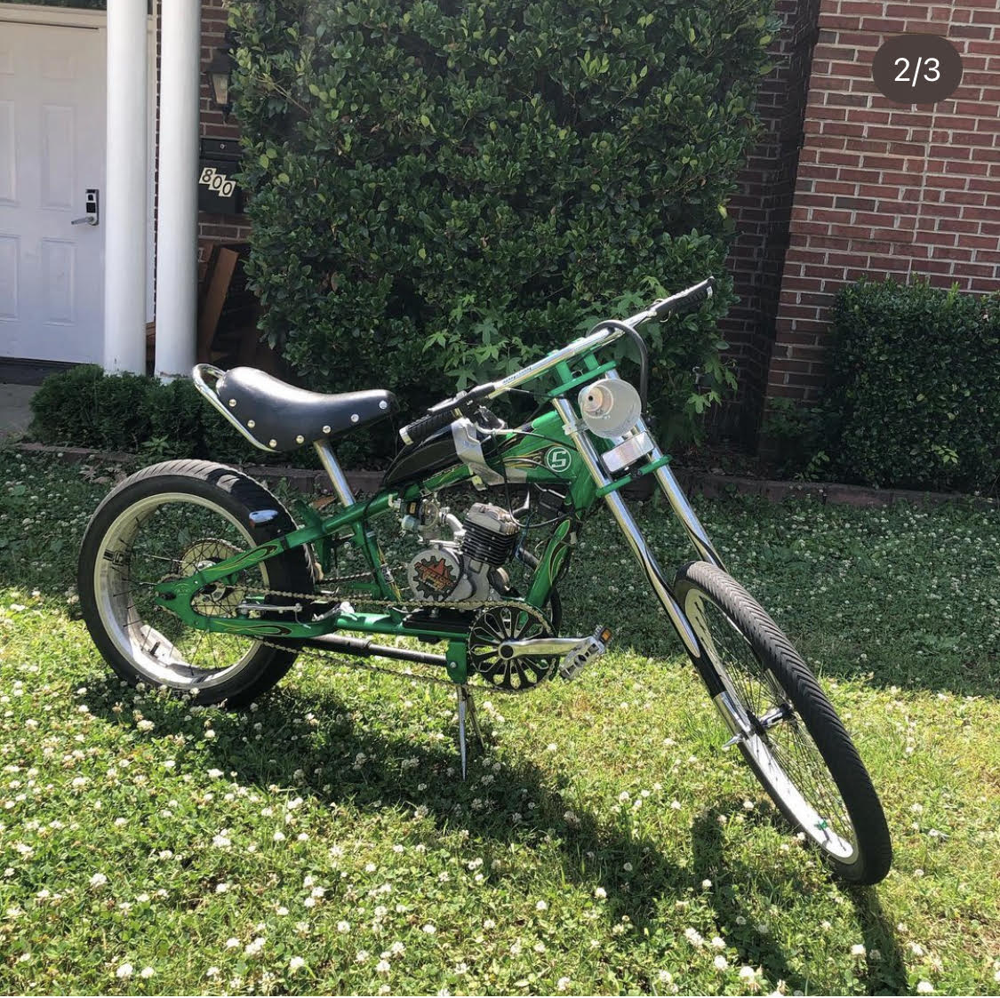

2 stroke engine kits are a really fun way to motorize any bicycle and have a fun quasi motorcycle like experience riding around if done properly. Given their simple nature they also allow for a lot of experimentation and upgrading and are quite cheap and modular. I built several of these bikes over the course of my undergrad years and even used them as commuter vehicles when I was near enough to campus. 

<pr>After deciding I wanted to build a small chopper style motorcycle, I obtained my first Schwinn Chopper bicycle and bought a 2 stroke engine kit. I obtained a proper motor mount for the Chopper frame along with a long exhaust pipe and put the whole bike together within a day. The top speed of the bike was ~25mph and given that it was straight piped it was very loud. I did later learn the hard way to keep my bikes inside after use as this first bike was later stolen. 
</pr>