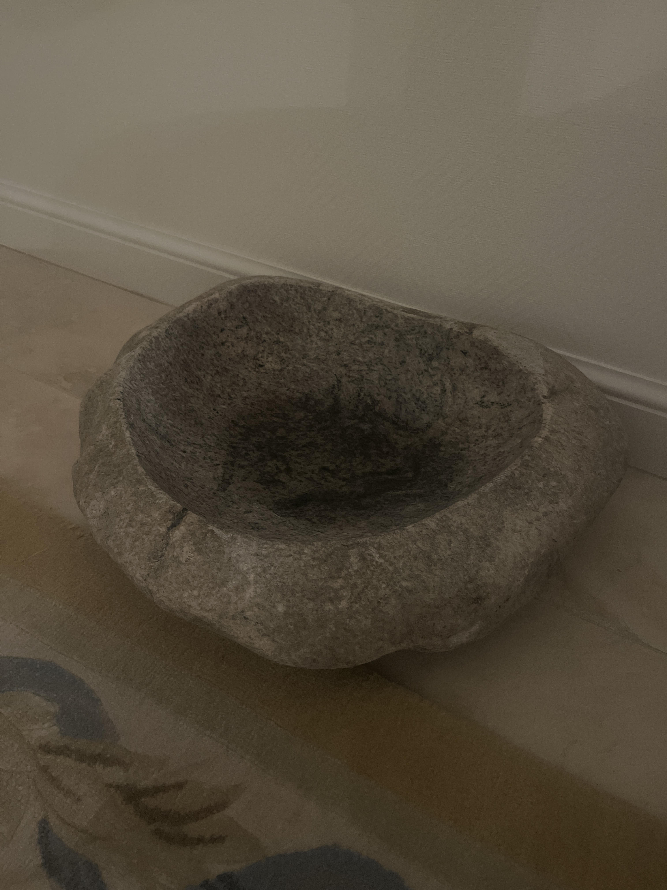
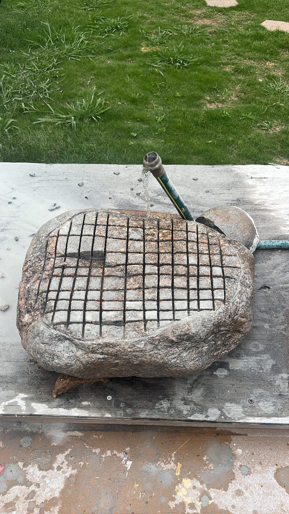
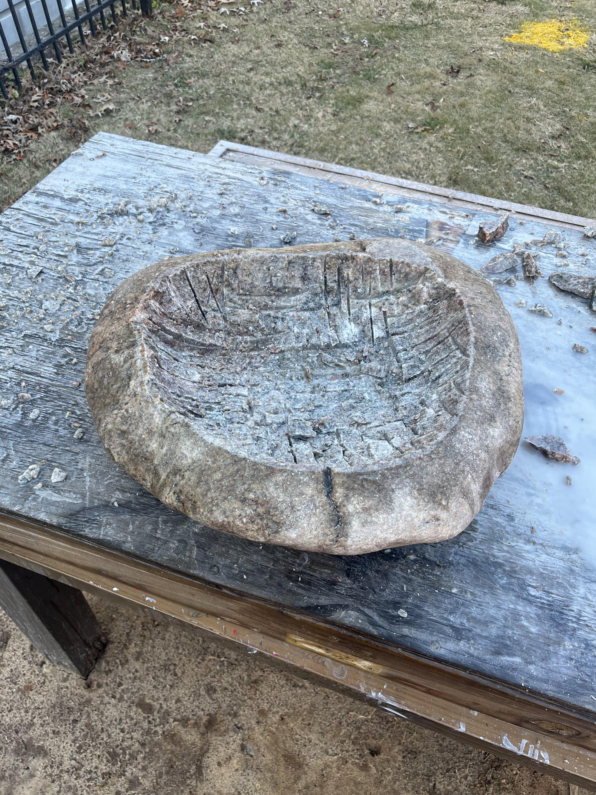

During my internship at Atom Computing in Boulder, I had the idea that it would be cool to turn a rock into a sink. This idea kept sticking with me and before my internship ended,  I drove into the mountains near Boulder, hiked to a river nearby the road, and iteratively carried on the order of 200 pounds worth of stones back to my truck. 

<pr> 
After driving back to Georgia Tech with the stones, I chose the largest one of them and began carving/cutting the basin out. I drew an approximate perimeter of the basin with chalk and proceeded to use a large 6" angle grinder with a diamond cutting wheel to cut a grid into the stone. I then used a hammer and chisel to break off the rectangular chunks in the grid. I repeated this process until I had the approximate shape of the bowl I desired. During this process I also used this process on the underside of the rock to creat a flat base for the rock basin. 
<figure>
    
    <figcaption>Grid Pattern for a Stone Bowl. NOTE: this was from a different bowl that I carved <figcaption>
</figure>
</pr>

<pr>
Once I had the approximate shape, I went inwth the hammer and chisel to knock off any large stone segements that were jutting out from the basin. I then went in with a smaller angle grinder with a concrete smoothing disk to get a roughly smooth basin. This was followed by another finer smoothing disk on the angle grinder to get an even smoother surface of the basin and remove any divots before the final sanding. I then used a drill with a sanding wheel attachments and stone sanding/polishing disks (starting with 80 grit and went up to 1500). The final basin had an incredibly smooth finish. 
</pr>